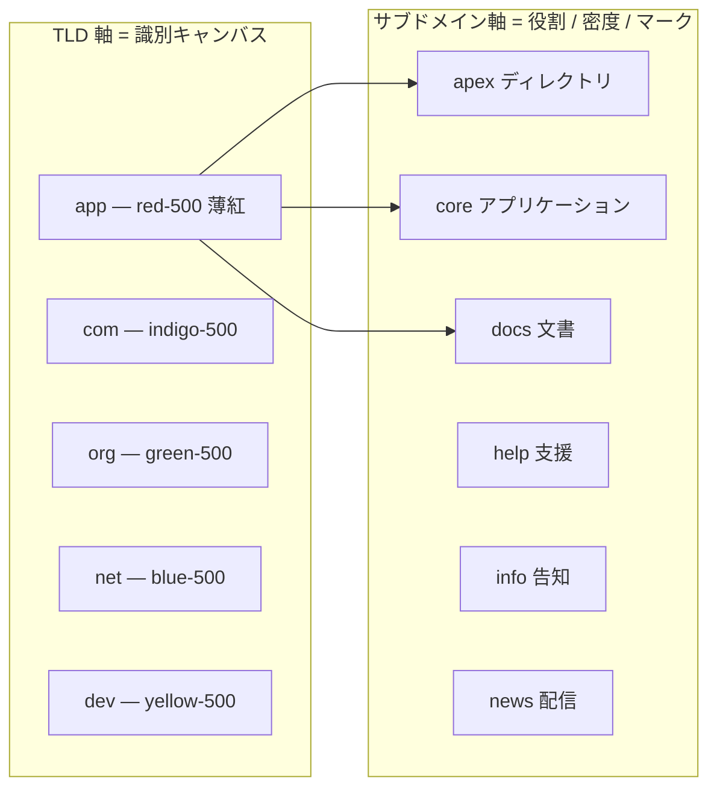
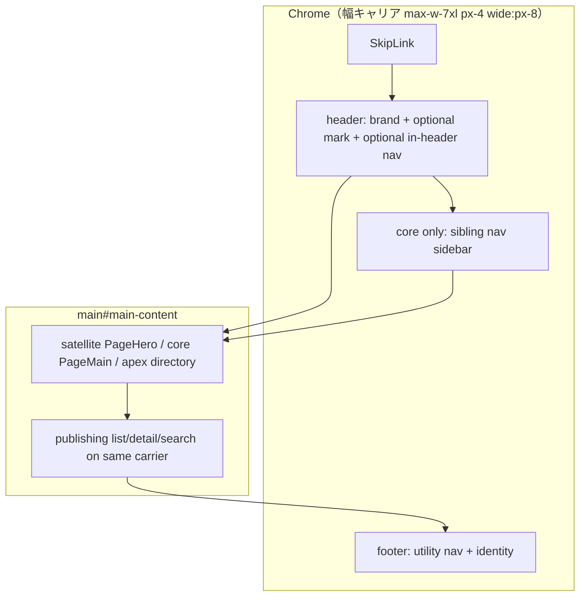

# UMAXICA Edge HTML 面の視覚アイデンティティ行列

| 項目           | 値                                                         |
| -------------- | ---------------------------------------------------------- |
| 文書           | 提案書（視覚デザインのみ。CSS / マークアップは実装しない） |
| 対象リポジトリ | `umaxica-apps-edge`                                        |
| 著者           | TBD                                                        |
| 日付           | 2026-09-21                                                 |
| 状態           | Draft                                                      |

---

## Overview

20 の HTML 配信単位（Hono apex Worker 5 + TanStack Start core 3 + 公開コンテンツ cell 12）は、シェル契約上は一つの家族だが、**色相は全単位で同一の `#2563eb`** であり、**サブドメインはアーキタイプ差（core / satellite / apex）にしか現れていない**。訪問者が同じ TLD の中で横に動いても、同じサブドメインを TLD 間で縦に動いても、いまの画面は「同じテンプレートのコピー」に見える。

本提案は、閉じた製品決定に従い、**TLD が識別色（`--ui-tint`）を所有し、サブドメインが役割・密度・タイポグラフィック・マークを所有する行列**として視覚を組み直す。識別色の値は Rails（`umaxica-apps-global`）の `--ui-tint` と一致する。用途は **ページ背景の薄い混色**であり、ボタンやリンクの全面アクセントではない。操作アクセントとフォーカスリングは TLD に依らず青（現行 `--color-brand` / `#2563eb`、Rails の `--ui-accent` / `--ui-ring` と同じ `blue-600`）に残す。

この refresh が出荷するのは、(1) satellite のロックアップ、幅キャリア揃え、current-nav チップ、契約の既知事実の訂正と 12 面のシェルテスト、(2) TLD ごとの `--ui-tint` と `color-mix` キャンバス、である。本文書は提案である。実装は後続の批判的レビューを経て行う。

---

## Background & Motivation

### いまの状態

- 規範は [`docs/design/ui-shell-contract.md`](docs/design/ui-shell-contract.md)（以下「契約」）。各 unit がシェル・stylesheet・`@theme` を所有し、共有 UI パッケージも共有 Tailwind preset もない（[`test/deployment-unit-boundaries.test.ts`](test/deployment-unit-boundaries.test.ts)）。
- ルート [`DESIGN.md`](DESIGN.md) は shadcn/ui 風の semantic token（`primary` / `muted` / `--radius` / chart series）を語るが、20 unit の stylesheet はその語彙を使っていない。
- 契約 §9 は `--color-brand` を全アーキタイプで同一リテラルにピンしている。それが「家族」の定義になっており、TLD 差を視覚から消している。
- 12 の satellite は `src/` / `test/` / `e2e/` が `src/lib/publishing-cell.ts` 以外 byte-identical（[`test/publishing-cells.test.ts`](test/publishing-cells.test.ts)）。`messages/*.json` はそのテストの外だが、各 cell のカタログは四種の `site*Product` をすべて含んでコピーされている。identity を「直す」ために一つの cell だけ `messages/` を編集してはならない。Docs / Help / Info / News の差はコピー（`siteCopy.product` が `Docs` / `Help` / `Info` / `News`）にしかない。

### 痛み

1. **TLD 軸が不可視。** `app` の Docs と `org` の Docs は同じ青、同じ Inter、同じヒーロー。タイトルの `(APP)` / `(ORG)` だけが家族を区別する。
2. **サブドメイン軸がアーキタイプ分割で止まっている。** core のサイドバーと `text-2xl`、satellite の `PageHero`、apex のディレクトリ、という三分割は正しいが、satellite 四種は同一の underlined link + 同一ヒーローである。
3. **契約と実装が既にずれている。** satellite はヘッダー内に実在ルートのナビを持ち、12 unit に `test/ui-shell-contract.test.tsx` が無い。契約 §16 は「全 20 unit がこのテストで証明している」と書いており、文書がコードより古い。
4. **幅キャリアのドリフト。** ヒーローは契約 §8a / §9 の `max-w-7xl px-4 wide:px-8` に乗っているが、entries / search / detail は `max-w-4xl px-6` で、見出しがブランドより内側に沈む。

---

## Goals & Non-Goals

### Goals

- **横移動**（同一 TLD・異なるサブドメイン）で、一つの家族のクロームと、サブドメインのマーク（product 語）が見える。キャンバスの色味は同じ。
- **縦移動**（同一サブドメイン・異なる TLD）で、ページ地の薄い色味が TLD を示す。リンクとフォーカスはどの TLD でも青。
- 識別色は **未希釈の塗りでも本文インクでもない。** 白 85%（apex dark は zinc-950 92%）との `color-mix` だけ。cell ごとの第二色相は置かない。
- サブドメインは役割・密度・タイポグラフィック・マークで区別する。
- 契約のうち **いま既に真な事実**（in-header nav、stale breakpoint 行、core-only Cookie、12 面に名前付きテストが無い、§16 の過大な適合宣言）を訂正する。マーク / 幅 / current-nav / `--ui-tint` は、それを実装するコミットと一緒に契約へ書く（§17）。
- 12 satellite に契約 §1 が名付ける `test/ui-shell-contract.test.tsx` を **追加**する（復元ではない）。
- `<main>` 内の幅キャリアを契約 §8a に揃える。一覧・検索・詳細の読みカラムは 80rem に伸ばさない。新規ルートは作らない。

### Non-Goals（本 refresh の外）

- `/health*`、`/revision`、`robots.txt`、`sitemap.xml` の見た目。
- satellite / core の 429 文書のスタイル（hashed CSS URL を limiter が知らない。契約 §16 gap 9）。
- About ラベルの統一（`概要` vs `このサイトについて`）。コピー判断でありトークンではない。
- i18n 機構の一本化、Privacy / Terms ルート、テーマ cookie の writer、ロゴ SVG の新造、新規ライブラリ、GitHub への書き込み。
- Rails staff UI、`tools/vpc-probe`（HTML 無し）。
- 識別色をボタン・リンク・フォーカスに載せる（Rails `--ui-accent` は TLD 非依存の青。Edge `--color-brand` も同様）。
- Rails の `--ui-*` セマンティック一式（fg / border / danger 等）の移植。Edge が足すのは `--ui-tint`、`--ui-canvas`、および `bg-canvas` 用の `@theme inline --color-canvas: var(--ui-canvas)` だけ。

---

## 現状 20 cell の検証済み批判

以下はツリーを読んだ結果である。未確認の主張は採用していない。

### 1. TLD 軸は視覚的に不可視

**確認: 正しい（リテラルと cell 宣言を除く）。**

`--color-brand: #2563eb` は次の 20 ファイルすべてに存在する。

| アーキタイプ   | パス                                                | 備考                               |
| -------------- | --------------------------------------------------- | ---------------------------------- |
| satellite × 12 | `{app,com,org}/{docs,help,info,news}/src/style.css` | 76 行付近。dark オーバーライド無し |
| core × 3       | `{app,com,org}/core/src/globals.css`                | 85 行付近。dark オーバーライド無し |
| apex × 5       | `{app,com,org,net,dev}/apex/src/style.css`          | 100 行付近。dark 時のみ `#93c5fd`  |

`diff -q` で `app/docs/src/style.css` と `com` / `org` の同名ファイル、`app/core/src/globals.css` と `com` / `org`、`app/apex/src/style.css` と他 4 apex は **差が無い**。TLD 差は次のリテラルに閉じている。

- satellite: [`src/lib/publishing-cell.ts`](app/docs/src/lib/publishing-cell.ts) の `PUBLISHING_AUDIENCE`、`BRAND_TITLE`（例 `UMAXICA (APP)`）、`CANONICAL_ORIGINS`
- core: [`src/lib/title.ts`](app/core/src/lib/title.ts) の `BRAND_TITLE`、[`src/components/site-footer.tsx`](app/core/src/components/site-footer.tsx) の `CANONICAL_HOME_URL`
- apex: [`src/brand.ts`](app/apex/src/brand.ts) の `BRAND_TLD`、[`src/shell.tsx`](app/apex/src/shell.tsx) の `CANONICAL_HOME_URL`、[`src/page-content.tsx`](app/apex/src/page-content.tsx) の origin 文

契約 §1 の「アーキタイプ内は TLD リテラル以外 byte-identical」は、視覚ソースについては成立している。それが問題である。

### 2. サブドメイン軸はアーキタイプ分割で止まっている

**確認: 正しい。加えて契約 §8 の breakpoint 行は stale。**

| アーキタイプ | `<h1>`                                                                                                                    | ナビ                                                                                                  | 実ファイル                                                                                    |
| ------------ | ------------------------------------------------------------------------------------------------------------------------- | ----------------------------------------------------------------------------------------------------- | --------------------------------------------------------------------------------------------- |
| core         | `text-2xl leading-heading font-semibold tracking-tight`（[`page-heading.tsx`](app/core/src/components/page-heading.tsx)） | サイドバー `<nav id="main-navigation">`（[`app-chrome.tsx`](app/core/src/components/app-chrome.tsx)） | 3 unit 同一                                                                                   |
| satellite    | `text-4xl … wide:text-5xl`（[`page-hero.tsx`](app/docs/src/components/page-hero.tsx)）                                    | ヘッダー内 Home / Entries / Search                                                                    | 12 unit、`page-hero.tsx` / `site-header.tsx` / `entry-collection.tsx` は相互に byte-identical |
| apex         | `text-3xl`（[`page-content.tsx`](app/apex/src/page-content.tsx) `PageTitle`）                                             | 無し（ディレクトリ行のみ）                                                                            | 5 unit。`net` / `dev` だけ `/` にディレクトリ本文                                             |

satellite のリンクは一覧・詳細・ヒーロー CTA で `underline`、フッター utility は `text-brand` で下線無し。Docs / Help / Info / News の視覚差は **ゼロ**。差は `siteCopy` の文字列だけ（例 ja: `UMAXICA ドキュメント` / `UMAXICA ヘルプ` / `UMAXICA インフォメーション`、product は `Docs` / `Help` / `Info` / `News`）。

契約 §8 Allowed は satellite の breakpoint を「none」と書く。実装は `wide:px-8` と `wide:text-5xl` を既に使っており、契約 §11 の「frame は `@media (min-width: 50rem)` をちょうど一つ出す」と整合する。**stale なのは §8 の表であり、実装ではない。**

### 3. ルート `DESIGN.md` は本ツリーが使っていない shadcn トークンを記述する

**確認: 正しい。**

[`DESIGN.md`](DESIGN.md) L12–17 は `src/styles.css` の「shadcn/ui's neutral base」「hue only on `destructive` and the chart series」「`--radius`」を前提にする。20 unit に `src/styles.css` は無く、`destructive` / chart / `--radius` トークンも無い。規範は契約であり、`DESIGN.md` は本 refresh の入力にしない。実装後も視覚の正本は契約へ足す（`DESIGN.md` の書き換えは必須ではない。触るなら「本リポジトリでは非規範」と一行足す）。

### 4. 幅キャリアのドリフト

**確認: 正しい。search / detail / 失敗文書にも同じドリフトがある。**

| 面                                     | 幅           | ガター             | ファイル                                                                                                                                                                                                     |
| -------------------------------------- | ------------ | ------------------ | ------------------------------------------------------------------------------------------------------------------------------------------------------------------------------------------------------------ |
| 契約 §9 / `PageHero` / header / footer | `max-w-7xl`  | `px-4` `wide:px-8` | [`page-hero.tsx`](app/docs/src/components/page-hero.tsx) L28                                                                                                                                                 |
| `EntryCollection`                      | `max-w-4xl`  | `px-6`             | [`entry-collection.tsx`](app/docs/src/components/entry-collection.tsx) L20                                                                                                                                   |
| search                                 | `max-w-4xl`  | `px-6`             | [`$lang.search.tsx`](app/docs/src/routes/$lang.search.tsx) L59                                                                                                                                               |
| entry detail                           | `max-w-4xl`  | `px-6`             | [`$lang.entries.$publicId.tsx`](app/docs/src/routes/$lang.entries.$publicId.tsx) L55                                                                                                                         |
| 404 / 500 / offline / unavailable      | キャリア無し | `p-6` 中央寄せ     | [`status-documents.tsx`](app/docs/src/components/status-documents.tsx)、[`offline.tsx`](app/docs/src/routes/offline.tsx)、[`publishing-unavailable.tsx`](app/docs/src/components/publishing-unavailable.tsx) |

ヒーローの `<h1>` はブランドと同じ左端に揃い、一覧の `<h1>` は `max-w-4xl` + `px-6` のためデスクトップで内側へ沈む。これが契約 §8a が禁止した「ほぼ揃っているガター」。

失敗文書の中央寄せは「短い回復メッセージ」という役割差として **allowed に昇格してよい**（新規ルートではない）。一覧・検索・詳細の `max-w-4xl px-6` は **drift** であり、本 refresh の対象。

### 5. 契約 §5 と satellite ナビ、テスト欠落

**確認: 正しい。契約 §8 / §12 / §16 も同様に stale。**

契約 §3 / §5 は `<nav>` を `<header>` の **sibling** とし、satellite は「単一面なのでメインナビ無し」とする。実装の [`site-header.tsx`](app/docs/src/components/site-header.tsx) は Home / Entries / Search を `<header>` 内の `<nav aria-label={t.primaryNavLabel}>` に置く。ラベルは ja `メインナビゲーション`（[`paraglide/messages/ja.js`](app/docs/src/paraglide/messages/ja.js)）。e2e [`app/docs/e2e/smoke.spec.ts`](app/docs/e2e/smoke.spec.ts) はこのナビをブラウザ経路として断言している。

`test/ui-shell-contract.test.tsx` が存在する unit:

- ある: `{app,com,org}/core/test/ui-shell-contract.test.tsx`。**三 core とも** その横に leftover `test/app-shell.test.tsx` がある。契約 §16 gap 10 が言う `application-shell.test.tsx`（com/org）は既に無い。リネームは本 refresh の外（三 core をキャンバス以外で触らない限り）。
- 無い: 12 satellite（`ui-shell-contract.test.tsx` も `app-shell.test.tsx` も無い。追加するファイルであり、復元するファイルではない）
- apex: `{app,com,org,net,dev}/apex/api/ui-shell-contract.hurl`（契約どおり。apex の Vitest シェルを作ってはならない）

契約 §8 は satellite の断言先を `test/ui-shell-contract.test.tsx` と書き、§12 は `aria-current` を core のみ、§16 は全 20 がそのテストで証明している、と書く。**コードは 12 satellite で `aria-current="page"` を既に出している。** 文書が遅れている。

### 6. カラースキーム: apex のみ dark、frame は light-only。Cookie 境界は core に限定

**確認: 大筋正しい。契約 §9a の「frame は Cookie を剥がす」は satellite には当てはまらない。**

- apex: [`src/theme.ts`](app/apex/src/theme.ts) が `theme` cookie を読み、[`src/style.css`](app/apex/src/style.css) が `@custom-variant dark` を `data-theme` ∪ `prefers-color-scheme` で定義。`--color-brand` を dark で `#93c5fd` に差し替える。`color-scheme: light dark`。本文は `dark:bg-gray-950`。
- 15 frame: `dark:` ユーティリティは **0 件**。`<html>` に `data-theme` 無し。[`app/core/src/routes/__root.tsx`](app/core/src/routes/__root.tsx) / [`app/docs/src/routes/__root.tsx`](app/docs/src/routes/__root.tsx) は `bg-gray-50 text-gray-900` のみ。
- Cookie 剥離は **core の application-owned パスだけ**。[`{app,com,org}/core/src/worker.ts`](app/core/src/worker.ts) `stripApplicationCookie`。ADR 007 の対象は共有 FQDN の Core。satellite の [`request-handler.ts`](app/docs/src/request-handler.ts) は Cookie を剥がさない。[`docs/development/browser-cookie-access.md`](docs/development/browser-cookie-access.md) も Core に限定して書いている。
- どの unit も theme cookie を **書いていない**。apex の cookie 分岐は今日、実効的に OS 追従だけ。
- apex [`src/theme.ts`](app/apex/src/theme.ts) も契約 §9a と同じ一般化（「each frame’s `src/worker.ts` strips Cookie」）をコメントしている。コードは core だけ。キャンバス PR（apex を触るとき）でコメントを直す。

契約 §9a の「A frame never sees the cookie: its `src/worker.ts` strips…」は core を 15 frame に一般化しすぎている。**いま既に真な訂正**として PR 1 で契約だけ直す（実装は変わらない）。

### 7. current-nav のキューがアーキタイプで違う

**確認: 正しい。satellite は weight も付けている。**

- core（[`app-chrome.tsx`](app/core/src/components/app-chrome.tsx) L140）: `aria-[current=page]:bg-gray-100 aria-[current=page]:font-semibold`。インクは本文色のまま。**塗り + ウェイト。** 色だけではない。
- satellite（[`site-header.tsx`](app/docs/src/components/site-header.tsx) L43）: 既定 `text-brand`、current `aria-[current=page]:font-semibold aria-[current=page]:text-gray-900`。**色相の入れ替え + ウェイト。** 既定リンクが brand 色なので、「今いる場所」がグレーに落ちる。

本 refresh は satellite も **塗り + ウェイト**（インクは本文色）に寄せる。core のサイドバー行クラスをそのまま inline リンクに貼るだけでは、ハイライトがグリフ幅にクリップする。ヒット領域のレシピは後述。brand 色は本文リンク・フッター utility・スキップリンク・フォーカスリングに残す。色だけが current を運ばない（契約 §12）。コントラスト比 4.95:1（light `#2563eb` on `gray-50`）と 3.90:1（同色 on `gray-950`）は契約 §9 / apex `style.css` コメントからの **継承値**であり、本提案では再計測していない。

### 補足（検証時に見つかった関連事実）

- ロゴ SVG は in-tree に無い。ブランドはテキスト `UMAXICA`。新造しない。
- apex は webfont 無し（システム日本語スタック）。frame は `@fontsource-variable/inter` + 日本語システムフォールバック。CSP は frame が `font-src 'self' data:`（[`security-headers.ts`](app/docs/src/security-headers.ts)）、apex も `fontSrc: ["'self'", 'data:']`（[`apex/src/security-headers.ts`](app/apex/src/security-headers.ts)）。CDN フォントは不可。
- apex の `@media` は `prefers-color-scheme` のみ。`wide:` は `@theme` にあるが markup では未使用。第二 breakpoint は追加しない。
- `net` / `dev` は apex のみ。`/` がディレクトリ文書（`app` / `com` / `org` の `/` は 301）。行列の空欄はプレースホルダページで埋めない。

---

## Proposed Design

### 行列の読み方



横移動（例: `docs-jp.umaxica.app` → `help-jp.umaxica.app`）: キャンバスの色味は同じ。マークとコピーが変わる。  
縦移動（例: `docs-jp.umaxica.app` → `docs-jp.umaxica.org`）: マークとレイアウトは同じ。ページ地の薄い色味だけが TLD で変わる。リンク・フォーカス・ボタン相当はどの TLD でも青。

### 面グリッド（意図的な空欄）

|     | apex (Hono)              | core          | docs       | help       | info       | news       |
| --- | ------------------------ | ------------- | ---------- | ---------- | ---------- | ---------- |
| app | ディレクトリ + 301 `/`   | アプリ chrome | コンテンツ | コンテンツ | コンテンツ | コンテンツ |
| com | ディレクトリ + 301 `/`   | アプリ chrome | コンテンツ | コンテンツ | コンテンツ | コンテンツ |
| org | ディレクトリ + 301 `/`   | アプリ chrome | コンテンツ | コンテンツ | コンテンツ | コンテンツ |
| net | ディレクトリホームページ | —             | —          | —          | —          | —          |
| dev | ディレクトリホームページ | —             | —          | —          | —          | —          |

`—` は「未実装」ではなく **この TLD にその役割が無い**。空欄を埋める画面を作らない。`net` / `dev` は同じ apex アーキタイプのディレクトリとして家族に入る。識別キャンバスだけが TLD で違う。

### TLD × 識別色（値は確定。用途はキャンバス混色だけ）

根拠は Rails `umaxica-apps-global` の surface CSS（`--ui-tint`）と [`theme.css`](https://github.com/seahal/umaxica-apps-global/blob/main/src/styles/theme.css) の混色である。Edge はこの意味をコピーする。トークン名も `--ui-tint` / `--ui-canvas` に揃える（`--ui-fg` 一式は持ち込まない。YAGNI）。

| TLD    | 色         | Tailwind token | 実値（Tailwind v4 `-500`）   | 対象 unit                          |
| ------ | ---------- | -------------- | ---------------------------- | ---------------------------------- |
| `.app` | 赤         | `red-500`      | `oklch(63.7% 0.237 25.331)`  | apex, core, docs, help, info, news |
| `.com` | インディゴ | `indigo-500`   | `oklch(58.5% 0.233 277.117)` | 同上 6                             |
| `.org` | 緑         | `green-500`    | `oklch(72.3% 0.219 149.579)` | 同上 6                             |
| `.dev` | 黄         | `yellow-500`   | `oklch(79.5% 0.184 86.047)`  | apex のみ                          |
| `.net` | 青         | `blue-500`     | `oklch(62.3% 0.214 259.815)` | apex のみ                          |

混色（Rails `theme.css` と同じ式。地色を先に書く。`color-mix` 非対応エンジンは未希釈の `-500` ではなく白 / zinc-950 を得る）:

- ライトキャンバス: `color-mix(in oklab, var(--color-white) 85%, var(--ui-tint))`
- ダークキャンバス（**apex 5 だけ**）: `color-mix(in oklab, var(--color-zinc-950) 92%, var(--ui-tint))`

`--ui-tint` を載せる場所:

- **載せる:** ページ地（いまの `bg-gray-50` をキャンバスに替える）。`<body>` の背景。
- **載せない:** リンク、フォーカスリング、スキップリンク、フッター utility、apex ホスト名、ボタン相当、ヘッダー / フッター / サイドバーの面（それらは `bg-white` / `bg-gray-900` のまま）。`text-tint` も `bg-tint` の未希釈塗りも禁止。黄の `yellow-500` を本文インクにするとコントラストが壊れる。

操作アクセントは TLD 非依存の青:

| トークン                  | 役割                                     | 値                                                        |
| ------------------------- | ---------------------------------------- | --------------------------------------------------------- |
| `--color-brand`           | `text-brand` と `:focus-visible` outline | 全 20 unit で `#2563eb`（`blue-600`）。**TLD で変えない** |
| apex dark `--color-brand` | 同上の dark                              | `#93c5fd` のまま（`blue-300`）。TLD 差ではない            |

`--color-brand` を空にしない。`--ui-tint` も空にしない。未希釈の識別色をリンク色にしない。cell ごとの第二色相は禁止。同一 TLD の全 surface で `--ui-tint` は同一。

### サブドメイン × 役割 / 密度 / マーク

色を使わず、**ロックアップの語**と**密度**で役割を示す。ロゴ SVG は作らない。

| サブドメイン | 役割                 | 密度                                                                                                | タイポグラフィック・マーク                                   | ナビ                        |
| ------------ | -------------------- | --------------------------------------------------------------------------------------------------- | ------------------------------------------------------------ | --------------------------- |
| apex         | ドメインディレクトリ | 中。`text-3xl`。ホストは `font-mono`                                                                | マーク無し。ホスト名そのものが見出し                         | 無し                        |
| core         | アプリケーション     | 密。`text-2xl`。永続サイドバー `wide:grid-cols-[15rem_minmax(0,1fr)]`                               | マーク無し。サイドバーが役割                                 | 6 ルート、header の sibling |
| docs         | 文書サイト           | 疎。ホームはヒーロー `text-4xl` / `wide:text-5xl`、`py-12`。一覧・検索・詳細の `<h1>` は `text-3xl` | ヘッダー lockup の product 語（`siteCopy.product` → `Docs`） | ヘッダー内 3 リンク         |
| help         | 支援サイト           | 同上（satellite 共通密度）                                                                          | `siteCopy.product` → `Help`                                  | 同上                        |
| info         | 告知サイト           | 同上                                                                                                | `siteCopy.product` → `Info`                                  | 同上                        |
| news         | 配信サイト           | 同上                                                                                                | `siteCopy.product` → `News`                                  | 同上                        |

satellite 四種の密度をこれ以上分けない（YAGNI）。一覧の行間やカード形状を News だけ変える、といった差は製品要求が無い。**見える差はロックアップの語と `siteCopy` の見出しコピーだけ**で足りる。コピー文言自体は本 refresh の外。

マークのマークアップ。現行 [`site-header.tsx`](app/docs/src/components/site-header.tsx) は `justify-between` の幅キャリアに **子が二つ**（brand `<a>` と `<nav>`）である。product を第三子にすると行の中央へ飛ぶ。lockup は **一つの flex 子**にまとめる。

```tsx
<header className="border-b border-gray-200 bg-white">
  <div className="mx-auto flex min-h-14 w-full max-w-7xl flex-wrap items-center justify-between gap-4 px-4 wide:px-8">
    <div className="inline-flex min-h-11 items-baseline gap-2">
      <a
        className="inline-flex min-h-11 items-center text-xl font-bold tracking-wide"
        href={homePath(locale)}
      >
        {t.brand}
      </a>
      <span className="text-sm font-medium tracking-wide text-gray-600">
        {product}
      </span>
    </div>
    <nav aria-label={t.primaryNavLabel}>{/* Home / Entries / Search */}</nav>
  </div>
</header>
```

- `product` は `siteCopy(locale).product`（[`site-copy.ts`](app/docs/src/lib/site-copy.ts)、`PUBLISHING_SURFACE` 経由）。`SiteHeader` に `product` を渡すか、同関数を呼ぶ。`UI[locale].brand` は `UMAXICA` のまま。
- 第二のリンクにしない。ブランドリンクは locale home。
- `text-brand` をマークに使わない。
- core / apex には置かない。
- **320×640:** lockup（brand + product）は一塊のまま。`<nav>` は別 flex 子として下へ wrap してよい。lockup の中で brand と product が画面左右に割れない（`inline-flex` + `flex-wrap` を lockup には付けない）。

`PageHero` 下の `siteName`（例 `UMAXICA ドキュメント`）は現状どおり残す。ヘッダーの短い product 語とヒーロー下の日本語サイト名は、**クロームのマーク**と**ページの帰属**である。

### Allowed difference vs drift

実装コミットが契約を更新するときの表。PR 1 はこれに **全部置換しない**。PR 1 は既に真な行だけ直す。マーク / 幅 / current-nav は satellite 実装と同時。`--ui-tint` はキャンバス実装と同時。

#### Allowed（理由を書ける差）

| 差                         | core                                                                 | satellite                                                              | apex                                                         | 理由                                                                                                                                                                                       |
| -------------------------- | -------------------------------------------------------------------- | ---------------------------------------------------------------------- | ------------------------------------------------------------ | ------------------------------------------------------------------------------------------------------------------------------------------------------------------------------------------ |
| `--ui-tint` の値           | 同一 TLD なら同じ（上表）                                            | 同左                                                                   | 同左。dark キャンバス混色は apex のみ                        | TLD が識別キャンバスを所有する                                                                                                                                                             |
| `--color-brand` の値       | 全 TLD `#2563eb`                                                     | 同左                                                                   | 同左。dark は apex のみ `#93c5fd`                            | 操作アクセントは TLD 非依存の青                                                                                                                                                            |
| メインナビ                 | 6 ルート、header の sibling、`id="main-navigation"`、disclosure      | Home / Entries / Search、**header 内**、常時表示、disclosure 無し      | 無し                                                         | satellite は実在する intra-site 3 先。コンテンツサイトのローカルナビは brand の横が役割。core はサイドバーへリフローするアプリナビなので sibling のまま。**この行は既に真。PR 1 で契約へ** |
| Menu button                | あり `wide:hidden`                                                   | 無し                                                                   | 無し                                                         | satellite ナビは折り畳まない。空の disclosure は作らない                                                                                                                                   |
| タイポグラフィック・マーク | 無し                                                                 | header lockup の product 語                                            | 無し（ホスト名が見出し）                                     | サブドメインが役割を所有する。**satellite PR と同時に契約へ**                                                                                                                              |
| `<h1>` スケール            | `text-2xl`                                                           | ランディング: `text-4xl` `wide:text-5xl`。一覧・検索・詳細: `text-3xl` | `text-3xl`                                                   | コンテンツサイトのホーム vs index/article。ヒーロー規模を一覧に広げない                                                                                                                    |
| シェルの配線               | `_page.tsx`                                                          | `__root.tsx`                                                           | `renderer.tsx`                                               | 既存。失敗文書の chrome 有無がこれに従う                                                                                                                                                   |
| React Aria                 | `Button`                                                             | インストールのみ                                                       | 不可（Hono JSX）                                             | 契約 §3a                                                                                                                                                                                   |
| カラースキーム             | light-only                                                           | light-only                                                             | `data-theme` + `prefers-color-scheme` + dark `--color-brand` | 本 refresh の決定 B。後述                                                                                                                                                                  |
| webfont                    | Inter self-host                                                      | Inter self-host                                                        | 無し（システム日本語）                                       | apex に React も webfont も足さない                                                                                                                                                        |
| `wide:` の使用             | サイドバー・ガター・ページ padding                                   | ガターとヒーロー `<h1>` のみ                                           | markup では未使用（トークンは持つ）                          | breakpoint はリポジトリに一つ。apex は wrapping flex だけで足りる                                                                                                                          |
| 失敗文書                   | chrome 無し                                                          | chrome あり、中央寄せ可                                                | chrome 無し（stylesheet はリンク）                           | 配線場所に従う。中央寄せは短い回復メッセージ用                                                                                                                                             |
| シェル断言                 | `test/ui-shell-contract.test.tsx`（+ leftover `app-shell.test.tsx`） | §1 が名付ける `test/ui-shell-contract.test.tsx` を **追加**            | `api/ui-shell-contract.hurl`                                 | 契約 §1 / AGENTS.md の層。apex に Vitest シェルを作らない。satellite ファイル追加は実装 PR と同時。§16 を「15 frame が既にある」にはしない                                                 |
| About ja                   | `概要`                                                               | `このサイトについて`                                                   | `このサイトについて`                                         | コピー。本 refresh では触らない                                                                                                                                                            |

#### Drift（直す）

| 項目                                                     | 現状                                           | 収束先                                                                                                |
| -------------------------------------------------------- | ---------------------------------------------- | ----------------------------------------------------------------------------------------------------- |
| TLD でページ地が同じ `gray-50`                           | 識別色が無い                                   | `--ui-tint` + 85% 白混色のキャンバス。`--color-brand` は青のまま                                      |
| satellite 四種にマークが無い                             | 同一ヒーロー + 同一リンク                      | grouped lockup の product 語                                                                          |
| 幅キャリア                                               | entries/search/detail が `max-w-4xl px-6`      | `<main>` は `max-w-7xl px-4 wide:px-8`。内側の読みカラムは `max-w-prose`。カードを 80rem に伸ばさない |
| satellite current-nav                                    | `text-brand` ↔ `text-gray-900`、パディング無し | 後述のチップ（`px-3 py-2 rounded-lg` + 塗り + ウェイト）。既定インク `text-gray-900`                  |
| 契約が「satellite ナビ無し」「テストが 15 frame にある」 | 文書が古い                                     | PR 1 で **既に真な事実だけ**訂正。テストファイルは satellite PR で追加                                |
| `DESIGN.md` の shadcn 語彙                               | 非規範のまま放置されうる                       | 正本は契約。触るなら非規範と明記                                                                      |



---

## Token and markup contract

### `@theme` / `:root` 名

既存名は維持する。足すのは識別キャンバスの **二つだけ**。契約 §9 の「新しい値は同じ名前で、それを使う unit すべてに」に従う。Rails の `--ui-fg` 一式は足さない。

| 名前                                                   | 役割                                                      | 値の所有                                                      |
| ------------------------------------------------------ | --------------------------------------------------------- | ------------------------------------------------------------- |
| `--breakpoint-*: initial` / `--breakpoint-wide: 50rem` | 唯一の breakpoint                                         | 全 20 で同一                                                  |
| `--color-brand`                                        | リンクとフォーカス（操作アクセント）                      | **全 TLD 同一** `#2563eb`。空にしない                         |
| `--ui-tint`                                            | TLD 識別色。未希釈では塗らない。`@theme` に置かない       | **TLD が所有。** `var(--color-red-500)` 等。空にしない        |
| `--ui-canvas`                                          | 混色したページ地。`:root` のみ                            | `color-mix(in oklab, var(--color-white) 85%, var(--ui-tint))` |
| `--color-canvas`                                       | `--ui-canvas` の `@theme inline` 別名。`bg-canvas` のため | `var(--ui-canvas)`。混色式をここに直接書かない                |
| `--leading-body: 1.75` / `--leading-heading: 1.3`      | 日本語リーディング                                        | 全 20 で同一                                                  |
| `--font-sans`                                          | スタック                                                  | frame: Inter + 日本語システム。apex: 日本語システムのみ       |
| `--font-inter`                                         | frame のみ                                                | `'Inter Variable'`                                            |

追加しないもの: `--color-brand-docs`、`--radius`、shadcn の `primary` / `muted`、共有 preset、`--ui-accent` の二重定義（`--color-brand` がそれ）。

`--ui-tint` は `@theme` に置かない（`bg-tint` / `text-tint` を生やさない）。混色は `:root --ui-canvas`。`bg-canvas` のため `@theme inline { --color-canvas: var(--ui-canvas) }` で別名する（Rails `theme.css` と同じ二段。inline は参照を使用時に解決する）。

```css
/* 例: app/* 。com は indigo-500、org は green-500 */
:root {
  --ui-tint: var(--color-red-500);
  --ui-canvas: color-mix(in oklab, var(--color-white) 85%, var(--ui-tint));
}

@theme inline {
  --color-canvas: var(--ui-canvas);
}

/* apex のみ: 既存の :root { @variant dark { --color-brand: #93c5fd } } に混ぜる。第二ブロックを足さない。frame には置かない */
:root {
  @variant dark {
    --color-brand: #93c5fd;
    --ui-canvas: color-mix(in oklab, var(--color-zinc-950) 92%, var(--ui-tint));
  }
}
```

### 変わるユーティリティ（markup）

| 場所                                            | 現状                     | 変更                                                        |
| ----------------------------------------------- | ------------------------ | ----------------------------------------------------------- |
| `<body>`                                        | `bg-gray-50`             | `bg-canvas`                                                 |
| 全 `text-brand`                                 | `#2563eb`                | **値も参照も変えない**                                      |
| `:focus-visible`                                | `var(--color-brand)`     | そのまま                                                    |
| satellite `SiteHeader`                          | 子が brand と nav の二つ | grouped lockup（brand + product）が第一子。ナビは後述チップ |
| `EntryCollection` / search / detail の `<main>` | `max-w-4xl px-6`         | シェルキャリア。内側は `max-w-prose` スタック               |
| apex ディレクトリ行                             | `text-brand` on host     | インクは青のまま。キャンバスだけ TLD                        |

`@apply` は使わない。新しい CSS 規則が必要な場合は契約 §17 どおり理由を書く。本提案が追加する element rule は **キャンバスの `color-mix`（utility が混色を表せない）** だけ。フォーカスリングと日本語改行は既存。

### 複製の仕方

共有パッケージに上げない。変更はアーキタイプ内の全 unit に **同じコミットでコピー**する。

| 変更の種類                   | コピー先の数                                                 | 値だけ違う点                                                 |
| ---------------------------- | ------------------------------------------------------------ | ------------------------------------------------------------ |
| `--ui-tint` の宣言           | その TLD の全 HTML unit（app=6, com=6, org=6, net=1, dev=1） | tint トークンのみ。混色式は全 TLD 同一                       |
| satellite マーク / ナビ / 幅 | 12                                                           | `publishing-cell.ts` と `siteCopy.product` は既存差          |
| core chrome                  | 3                                                            | canonical URL / `BRAND_TITLE` リテラル                       |
| apex chrome                  | 5                                                            | origin リテラル。`net`/`dev` は `/` 本文あり（既存 allowed） |
| 契約                         | 1 ファイル                                                   | —                                                            |

`test/publishing-cells.test.ts` は 12 satellite の `src/` `test/` `e2e/` が `publishing-cell.ts` 以外 byte-identical であることを今も強制する。マークアップ変更は 12 全部に同じバイトを入れる。`messages/*.json` も四種の product 文字列を全 cell が持つコピーである。

`--color-brand` は全 TLD `#2563eb` のまま。`--ui-tint` は audience で違う。`test/publishing-cells.test.ts` は **`src/style.css` 全体を比較から外さない**。`--ui-tint:` の 1 行だけを正規化して 12 面を比較し、あわせて `PUBLISHING_AUDIENCE` → `var(--color-red-500)` / `indigo-500` / `green-500` を断言する。空トークンにしない。同一 audience の 4 surface は tint 行も含め byte-identical。

### apex を家族に残す

apex は React も Inter も持たない。家族の印は次で足りる。

- 同じ幅キャリア、同じ `min-h-14` / `min-h-11`、同じ `border-gray-200`、同じ `text-brand`
- 同じ `--color-brand`（全 TLD 青）と、TLD ごとの `--ui-tint` キャンバス
- ディレクトリ行の `font-mono` ホスト名（apex の役割マーク）
- `net` / `dev` は `/` がディレクトリであることで「空の列」ではなく「apex だけの列」に読める

apex に `wide:` を足さない。ヒーローを `text-4xl` にしない。product 語を付けない。

---

## Chrome vs page body

対象は既存面のみ。新規ルートは出さない。

### Skip link

現状維持。`absolute … -translate-y-full` / `focus:translate-y-0`、`href="#main-content"`、対象 `<main id="main-content" tabindex="-1">`。`transition` を足さない。色は `text-brand` のまま（**共有の青**。TLD インクではない）。

### Header

| アーキタイプ | 変更                                                                                                             |
| ------------ | ---------------------------------------------------------------------------------------------------------------- |
| apex         | body を `bg-canvas`。`--ui-tint`。dark キャンバス混色。`theme.ts` の Cookie コメント。`--color-brand` は触らない |
| core         | body を `bg-canvas`。`--ui-tint`。dark ブロックは足さない                                                        |
| satellite    | grouped lockup。ナビは header 内のまま。current は後述チップ                                                     |

### Core sidebar

[`app-chrome.tsx`](app/core/src/components/app-chrome.tsx) の `hidden data-[open=true]:grid wide:grid` と React Aria `Button` は維持。brand バーを `bg-brand` にしない。

### Satellite header nav

Home / Entries / Search は実在ルート。常時表示。`wide:` で隠さない（折り畳みは core の特権）。

`aria-current="page"` は exact（home / search）と entries の **prefix**（現状 `pathname.startsWith(entriesPath)`）を維持。詳細で Entries が current なのはコンテンツサイトとして正しい。core の `activeOptions={{ exact: true }}` をコピーしない。prefix は allowed として、**実装 PR と同じコミット**で契約に書く。

#### Satellite current-nav チップ（core の行クラスを inline に貼らない）

現行リンクは `inline-flex min-h-11 items-center text-brand` でパディングボックスが無い。`bg-gray-100` だけ足すとハイライトがグリフ幅にクリップする。

```tsx
<a
  className="inline-flex min-h-11 items-center rounded-lg px-3 py-2 text-gray-900 hover:bg-gray-100 aria-[current=page]:bg-gray-100 aria-[current=page]:font-semibold"
  href={link.href}
  {...(link.current ? { 'aria-current': 'page' as const } : {})}
>
  {link.label}
</a>
```

- 既定インクは `text-gray-900`（本文色）。`text-brand` はナビから外す。
- ヒット領域は `min-h-11` + `px-3 py-2` + `rounded-lg`。hover も同じ面ステップ。
- brand インクはフッター utility、スキップリンク、本文リンク（underline）に残す。

### Footer

utility `text-sm text-brand min-h-11`、identity `text-sm text-gray-600`。幅キャリアを維持。About 文言は触らない。canonical URL リテラルは触らない。

### `PageHero`

幅キャリア維持。`<h1>` スケール維持。`siteName` を `text-sm text-gray-600` のまま（brand 色に戻さない。契約 §8a が eyebrow の `text-brand` を外した理由）。CTA は `underline` 維持。

### Publishing list / detail / search

`<main>` をシェルの幅キャリアにする。**カード・フォーム・記事を 80rem に伸ばさない。**

```tsx
<main
  className="mx-auto w-full max-w-7xl flex-1 px-4 py-12 wide:px-8"
  id="main-content"
  tabIndex={-1}
>
  <div className="flex max-w-prose flex-col gap-6">
    <h1 className="text-3xl leading-heading font-semibold">
      {/* list/search/detail */}
    </h1>
    {/* cards, search form (w-72 input), article */}
  </div>
</main>
```

- ガターは header / footer / `PageHero` と同じ `px-4 wide:px-8`。見出しの左端が brand に揃う。
- 読みカラムは `max-w-prose`（65ch）。今日の `max-w-4xl` を残す理由は無い — §8a が既に prose を指定している。`max-w-4xl` はガタードリフトの一部として捨てる。
- カード（`rounded-lg border border-gray-200 bg-white p-4`）、検索（`w-72 max-w-full` + `rounded-full` submit）、`<article>` はこの内側スタックに収まる。
- list/search/detail の `<h1>` は `text-3xl` のまま。ヒーローの `text-4xl` / `wide:text-5xl` に揃えない（allowed: ランディング vs index/article）。
- タイトルリンクの `underline`、管理 / 編集の `text-brand underline` は維持。

### Apex directory

[`DomainList`](app/apex/src/page-content.tsx) の行ホバー `hover:bg-white dark:hover:bg-gray-900`、ホスト `font-mono text-brand` は維持。`net` / `dev` の `/` と `/about` の役割分担は触らない。

### Failure documents

core: chrome 無し、中央寄せ維持。  
satellite: chrome あり、中央寄せを **allowed** として契約に書く。幅キャリアへ無理に移さない（短いメッセージを 80rem 左端に置くと失敗面が「空のアプリ」に見える）。  
apex: `status-page.ts` の styled 404/500/offline/429 は本 refresh で新規スタイルを足さない。リンクは共有の青。キャンバスを status 文書の body に載せるなら、apex の他文書と同じ `--ui-canvas` を使う（別色を発明しない）。

---

## Dark scheme decision

**採択: (B) 15 frame は light-only のまま。**

(A) は apex の `dark:` トークンオーバーライドを `prefers-color-scheme` だけで frame に広げる案である。採らない。

### 理由

1. **識別色を本文リンクに載せない。** 黄 `yellow-500` は本文 AA を満たさない。Rails も tint をキャンバスにしか使わない。frame を dark にする必要は、キャンバス混色の light だけでは出ない。apex の `#93c5fd` は操作アクセントの dark であり、TLD 差ではない。
2. **機構が同じにならない。** apex は cookie ∪ OS。frame のうち core は ADR 007 で application-owned の Cookie を剥がす。satellite は Cookie を読めるが、Edge は theme cookie を書かない。A を「OS だけ」で入れると、将来 apex に cookie writer が付いた瞬間に家族が割れる。
3. **Core は Rails と FQDN を共有する。** Rails staff UI は本リポジトリの外であり、スキームは **このワークスペースでは未検証**である。Edge chrome だけを dark にすると、パス境界でスキームが跳ねるリスクがある、という仮定として扱う。
4. **YAGNI。** cookie writer・Preference UI は無い。Rails は同一 `--ui-tint` から dark キャンバスも混ぜる。Edge frame に dark を足すのは cookie 方針と Rails FQDN の確認のあと。
5. **家族の欠けは認める。** OS が dark の訪問者は、apex だけが暗く frame が明るい。apex dark キャンバスは 92% zinc-950 + tint で TLD を残す。A の再評価は cookie 方針と Rails 面の確認のあと。

契約 §9a の Cookie 文は **いま既に真**なので PR 1 で core 限定に直す。dark トークン表を frame に広げない。

---

## Contract repair

**採択: satellite の in-header nav を §8 Allowed に昇格する。`<nav>` を header の外へ移さない。**

satellite 実装 PR で 12 面に `test/ui-shell-contract.test.tsx` を **追加**する（§1 が既にこのファイル名を frame の層として書いている。ツリーに前身は無い。core のテストをコピーして断言を書き換える）。

### 理由

1. 行き先は実在する。契約 §5 が禁じたのは **死んだリンクを埋めること** であり、Home / Entries / Search は [`e2e/smoke.spec.ts`](app/docs/e2e/smoke.spec.ts) がブラウザ経路として証明している。
2. コンテンツサイトのローカルナビは brand の横が役割である。sibling に出すと core のアプリ chrome（サイドバー化前提）に近づき、サブドメインが密度を所有するという行列に逆行する。
3. satellite ナビは折り畳まない。`aria-expanded` も `wide:grid` も不要。header 内の wrapping flex で 320px が既に成立している。
4. 契約 §3 の「後からサイドバーやボトムバーにできるよう sibling にする」は **core の理由** である。satellite にそのリフロー計画は無い。

### 契約に書く変更の分割（§17）

§1 / §16 をロードマップにしない。「15 frame がテストを持つ」は PR 1 では **12 はまだ無い**と書く。実装後に「12 も持つ」へ更新する。

**PR 1（文書のみ。既に真な事実）:**

- §5 / §8: satellite は単一面ではない。Home / Entries / Search が header 内にある。apex はナビ無し。
- §3: 「`<nav>` は header の sibling」を **core のメインナビ**に限定。satellite の in-header を Allowed に書く（コードが既にそうだから）。
- §8 breakpoint: satellite は `wide:` をガターとヒーローに使う。apex markup は未使用。
- §8 / §16: 12 satellite に `test/ui-shell-contract.test.tsx` は **無い**。core 3 はある。apex は Hurl。§16 の「全 20 がこのテストで証明」を消す。
- §9a: Cookie 剥離は core。dark は apex のみ（コードどおり）。§9 の `--color-brand` リテラルは触らない。`--ui-tint` はキャンバス PR まで書かない。
- §12: satellite も `aria-current` を既に出している、と事実を書く。塗り+ウェイトへの変更はまだ書かない。
- gap 10: 三 core が `ui-shell-contract.test.tsx` と leftover `app-shell.test.tsx` を両方持つ。
- §17 は触らない。

**satellite 実装 PR と同時:**

- マーク、幅キャリア、current チップ、list `text-3xl` vs ヒーロー、テスト追加、§8 のそれらの行。

**キャンバス PR と同時:**

- §9 に `--ui-tint` / `--color-canvas` を足す。`--color-brand` は全 TLD 青のまま。apex `theme.ts` コメント。

satellite テストの中身（クラス名は断言しない。12 面で **同一バイト**。`Docs` をリテラルしない）:

- landmark: banner, main, contentinfo, 2× navigation（`メインナビゲーション` と `ユーティリティナビゲーション`）
- メインナビが `header` の内側。Menu ボタンが無い
- brand が `h1` ではない。**`siteCopy(locale).product` が brand リンクの横にある**（`PUBLISHING_SURFACE` が解決する。cell ごとにファイルを分けない）
- skip link が最初のフォーカス可能、`main#main-content[tabindex="-1"]`
- 死んだ Preferences / Privacy / Terms が無い
- canonical が identity 行に出る

ドライバは既存の [`test/utils/routes.ts`](app/docs/test/utils/routes.ts) `renderDocument`（publishing-pages と同じ。`app.request()` ではない）。

apex `api/ui-shell-contract.hurl` は「header 内にメインナビが無い」を維持。壊さない。

---

## API / Interface Changes

外部 HTTP 契約は変えない。変わるのは **見た目** と、実装コミットが同時に直す契約文書、およびテストが読む DOM 構造（product 語の追加、幅クラス。Hurl はクラスを見ないので apex Hurl は色だけでは落ちない）。

タイトル契約（`UMAXICA ({TLD})`、EM DASH）は維持。product 語は `<title>` に新たに足さない（satellite ルートは既に `Docs — UMAXICA (APP)` 形式）。

---

## Data Model Changes

なし。Cookie を増やさない。KV / D1 を触らない。`--ui-tint` は CSS カスタムプロパティであり、ビルド時の per-unit リテラルである。

---

## Alternatives Considered

### 1. 20 cell すべてに一つの UMAXICA 色相

**却下（製品決定）。** 現状そのものであり、TLD 軸が消える。縦移動で家族の「どの列にいるか」がタイトル文字列にしか出ない。

### 2. サブドメインが色相を所有する（Docs 青、News 赤、…）

**却下（製品決定）。** 横移動で色が飛び、同じ TLD の一体感が壊れる。cell ごとの第二色相は本提案でも禁止。

### 3. 共有 Tailwind preset / 共有 theme パッケージ

**却下。** 契約 §2 / §17 と `test/deployment-unit-boundaries.test.ts` が抽出可能性を機械検査している。複製は負債ではなく境界である。

### 4. satellite ナビを header の sibling に戻す

**却下（本提案の契約修復）。** 実装を古い契約に合わせると、satellite が core のアプリ chrome に寄る。行列はサブドメインにコンテンツ密度を要求する。

### 5. 決定 A: frame に `prefers-color-scheme` dark を広げる

**本 refresh では却下。** Dark scheme decision を参照。cookie 方針と Rails 面が揃ったら再提案する。

### 6. ロックアップに SVG マークを新造する

**却下。** in-tree に実在するマークが無い。YAGNI。テキストの product 語で足りる。

### 7. TLD 色を `--color-brand`（リンクとフォーカス）に載せる

**却下（所有者の整理）。** Rails は tint をキャンバス混色にしか使わない。黄 `yellow-500` をリンク色にすると AA が壊れる。青の操作アクセントは TLD 非依存。

---

## Security & Privacy Considerations

| 脅威                                                 | 深刻度 | 緩和                                                                                                                    |
| ---------------------------------------------------- | ------ | ----------------------------------------------------------------------------------------------------------------------- |
| キャンバス上の本文コントラスト                       | Medium | 地は白 85% + tint。本文は `gray-900`。実装後にキャンバス実測。リンクは青のまま（契約 §9 の 4.95:1 は継承）              |
| 色だけが current / リンク状態を運ぶ                  | Medium | current は塗り+ウェイト。リンクは下線（satellite 本文）またはホスト underline-on-hover（apex）。フォーカスは 2px リング |
| CSP `font-src` 逸脱（CDN フォント）                  | High   | 既存 `font-src 'self' data:` を維持。webfont 追加なし。apex はダウンロード無しのまま                                    |
| インライン `style=`                                  | Medium | `style-src-attr 'none'`。ユーティリティのみ                                                                             |
| 429 を飾って hashed CSS を手書き                     | Low    | やらない。limiter は CSS URL を知らない                                                                                 |
| theme cookie writer を frame に足して ADR 007 を破る | High   | やらない。決定 B                                                                                                        |
| ログに色やパスを足す                                 | Low    | 既存の閉じた emitter のみ。新フィールド無し                                                                             |

認証・認可モデルは不変。視覚は匿名公開面の話である。

---

## Observability

新しい log field は不要。色相もマークもリクエスト境界の outcome を変えない。

既存:

- apex: `@hono/structured-logger`（[`structured-logger.ts`](app/apex/src/structured-logger.ts)）
- frame: [`request-log.ts`](app/docs/src/lib/request-log.ts) / core の同名
- core → Rails: [`rails-dispatch-log.ts`](app/core/src/lib/rails-dispatch-log.ts)（閉じた union。path/cookie/body 無し）

`no-console` は error のまま。Playwright / Vitest に `console` を足さない。

メトリクス・アラート: バンドルサイズは `pnpm run build && pnpm run check:size`。予算は frame client JS 150 kB gzip、apex Worker 52 kB gzip（各 `.size-limit.json`）。本変更は JS を増やさない想定（CSS カスタムプロパティとユーティリティ）。超過したら原因を測ってから予算を触る。

---

## Rollout Plan

機能フラグは持たない（Edge に視覚フラグ基盤が無く、部分的 a11y は契約 §17 が禁ずる）。

apex / core のコメント専用 PR は出さない（YAGNI）。キャンバスは 20 HTML unit を同じ PR で入れる。

1. **PR 1** 契約の **既に真な事実**だけ。コード無し。
2. **PR 2** satellite 12: lockup、幅、current チップ、`test/ui-shell-contract.test.tsx` 追加、契約のそれらの行。12 同時。
3. **PR 3** `--ui-tint` + `--color-canvas` を 20 HTML unit。body `bg-canvas`。apex dark 混色。`publishing-cells` の tint 行。契約 §9。
4. **PR 4** smoke 拡張（viewport 320）、`check:size`、実行後の evidence。

ロールバック: 単位は PR。部分 revert（12 のうち 3 だけマーク付き、または 1 TLD だけキャンバス）は契約違反なのでしない。

---

## Risks

| リスク                                      | 深刻度 | 緩和                                                                                                                     |
| ------------------------------------------- | ------ | ------------------------------------------------------------------------------------------------------------------------ |
| 識別色をリンクに載せて黄が AA を割る        | High   | `--ui-tint` はキャンバス混色だけ。`--color-brand` は青のまま                                                             |
| 12 / 5 / 3 のコピー漏れ                     | High   | アーキタイプ全体を同一コミット。publishing-cells / 手動 diff。CI の既存 byte-identical を hex 行だけ緩める               |
| satellite テスト追加が 12 回コピペミス      | Medium | 1 unit で通してから 11 にコピー。`src`/`test`/`e2e` は byte-identical                                                    |
| Playwright が 20 サーバーを要求する         | Medium | 新規 matrix spec を作らない。既存 per-unit smoke を拡張。手動 6 面ウォークは evidence の任意記録でありマージ条件にしない |
| Inter + ユーティリティ追加で CSS 増         | Low    | JS budget は CSS を見ない。CSS 肥大は hashed asset。必要なら測る                                                         |
| 契約昇格をレビューが「§3 に戻せ」と差し戻す | Medium | 本提案が理由を書く。差し戻すなら 12 unit のナビ移動が別 PR になり、e2e も同時変更                                        |

---

## Out of refresh

| 面                                                                         | 理由                                                                                                                                                                                                                      |
| -------------------------------------------------------------------------- | ------------------------------------------------------------------------------------------------------------------------------------------------------------------------------------------------------------------------- |
| `/health`、`/health/startups`、`/health/livenesses`、`/health/readinesses` | `text/plain`。契約 §15                                                                                                                                                                                                    |
| `/revision`、`/api/v0/revision.json`                                       | 機械面                                                                                                                                                                                                                    |
| `robots.txt`、`sitemap.xml`                                                | 生成ルート                                                                                                                                                                                                                |
| satellite / core の 429 HTML                                               | hashed CSS を limiter が知らない。unstyled semantic のまま（契約 §16.9）。apex 429 は既に `status-page.ts` で stylesheet 付き — **触らない**（本 refresh の対象は視覚アイデンティティであり、429 を家族の「顔」にしない） |
| About コピー `概要` vs `このサイトについて`                                | コピー判断                                                                                                                                                                                                                |
| Privacy / Terms                                                            | ルートも本文も無い                                                                                                                                                                                                        |
| i18n 一本化、apex `lang="ja"` vs 英語本文                                  | 契約 §13 の未解決                                                                                                                                                                                                         |
| Rails staff UI                                                             | 別アプリ                                                                                                                                                                                                                  |
| `tools/vpc-probe`                                                          | HTML 無し                                                                                                                                                                                                                 |
| theme cookie writer、Preference UI                                         | `browser-cookie-access.md`                                                                                                                                                                                                |
| ロゴ SVG、第二 breakpoint、motion                                          | YAGNI / 契約 §12                                                                                                                                                                                                          |

---

## Verification

層は AGENTS.md どおり。同じ `GET /health → 200` を三層に置かない。Playwright に status / Content-Type を置かない。

### Vitest（内部論理）

- **追加**する `test/ui-shell-contract.test.tsx` × 12 satellite + 既存 × 3 core: landmarks、skip、brand、ナビ位置、**`siteCopy(locale).product`**（`Docs` リテラル禁止）、canonical、死リンク無し。
- `--ui-tint`: audience マップ。`--color-brand` は全 unit `#2563eb` のまま。
- core: 既存テストが sibling nav を維持。PR 1 は core テストを触らない。

### Hurl（HTTP 契約）

- 既存 `{app,com,org,net,dev}/apex/api/ui-shell-contract.hurl`: landmarks、skip、ナビ無し、stylesheet 1。色は XPath しない。
- 既存 title / status-surfaces。視覚 PR で壊さない。

### Playwright（ブラウザ経路）

新規 `e2e/visual-identity-matrix.spec.ts` は **作らない**。既存 smoke が既にシェル・ナビ・skip を見ている。同じ層にもう一枚ランドマークを積むのは AGENTS.md が禁ずる重複である。

satellite [`e2e/smoke.spec.ts`](app/docs/e2e/smoke.spec.ts) を 12 同一バイトのまま拡張する:

- `page.setViewportSize({ width: 320, height: 640 })` で lockup が一塊、nav が wrap して到達できる。
- brand の横に product 語が見える。期待文字列は **`siteCopy('ja').product` / `siteCopy('en').product`**（ヘルパーは unit 内にあり、cell ファイルが差を出す）。`Docs` をリテラルしない。
- 既存の Home/Entries/Search / skip 断言は残す。

core / apex の既存 smoke に 320 viewport を足してよい。product 語が **無い**こと、apex ホストが `font-mono` であることは、新しいファイルを増やさず足りれば足す。

縦の構造一致は 12 satellite spec が byte-identical であることで保証する。キャンバスの `toHaveCSS` は計算値が `rgb(…)` / `oklch(…)` / `color-mix` 解決後になり `#rrggbb` ではない。未希釈の `-500` を期待しない。

「app の 6 面を順に開く」手動ウォークは evidence に残してよい任意記録であり、**マージ条件にしない**。CI の e2e skip は維持する。

### サイズ

`pnpm run build && pnpm run check:size`。既存予算。上げる場合は実測を evidence に書く。

### Evidence

`evidence/YYYY-MM-DD-visual-identity-matrix.md` は **コマンドが通ったあと**だけ。レイアウトは [`test/evidence-layout.test.ts`](test/evidence-layout.test.ts): flat、`.md` のみ、`YYYY-MM-DD-<lowercase-hyphenated-topic>.md`。生ログやスクリーンショットは置かない。コマンド、計測、抜粋を書く。未実施なら「未実施」と理由を書く。本提案の時点では **この evidence ファイルを作らない**（チェック未実施）。

---

## Key Decisions

1. **TLD が `--ui-tint` を所有する。用途はページ地の薄い混色だけ。** 値は Rails と同じ `-500` トークン（app 赤、com インディゴ、org 緑、dev 黄、net 青）。未希釈では塗らない・書かない。
2. **操作アクセントは TLD 非依存の青。** `--color-brand` は全 20 で `#2563eb`。フォーカスリングも同じ。Rails `--ui-accent` / `--ui-ring` に合わせる。
3. **satellite 四種の差は grouped lockup の `siteCopy.product` であり、密度はアーキタイプ共通。** ヒーローと一覧の `<h1>` スケール差は allowed。
4. **決定 B: frame は light-only。** dark 列は apex 5 だけ。`#93c5fd` は暫定共有 dark インク。Rails staff のスキームは未検証の仮定。
5. **satellite in-header nav を §8 Allowed に昇格（コードが既にそうだから PR 1）。** sibling 化しない。
6. **`<main>` はシェルキャリア、読みカラムは `max-w-prose`。** カードを 80rem にしない。失敗文書の中央寄せは allowed。
7. **satellite current はパディング付きチップ（塗り+ウェイト、既定 `text-gray-900`）。** core の行クラスを inline に貼らない。
8. **共有 preset を作らない。** 複製はアーキタイプ全 unit 同一コミット。
9. **motion を足さない。**
10. **検証層を守る。** satellite シェルテストは追加。Playwright は既存 smoke を拡張。evidence は実行後だけ。
11. **契約は未来状態を先に書かない。** 実装と同一コミット（§17）。apex/core のコメント専用 PR は出さない。キャンバスは 20 unit を同じ PR で入れる。
12. **Rails の `--ui-*` 一式は移植しない。** Edge が足すのは `--ui-tint`、`--ui-canvas`、`@theme inline --color-canvas`。

---

## Open Questions

1. **公式識別色（回答済み）。** 下表。dark キャンバスは同一 tint の 92% zinc-950 混色であり、別の 5 hex は無い。操作アクセントの dark は共有 `#93c5fd` のまま。
2. **header の product 語の言語。** 実装は `siteCopy.product`（両ロケールとも `Docs` 等）を想定。ja では `ドキュメント` の方が正しい可能性。コピー判断。
3. **キャンバス PR を構造 PR の前に出してよいか。** 本提案は **構造（PR 2）のあと、全 20 unit のキャンバス（PR 3）**。所有者が「地色が先」なら順を入れ替える。部分 TLD だけのキャンバスは出さない。
4. **`test/publishing-cells.test.ts`（決定済み）。** `style.css` を除外しない。`--ui-tint:` 1 行を正規化して比較し、audience マップを断言する。
5. **決定 A の再評価トリガ。** Rails 面のスキーム確認 + cookie writer。本 refresh では開けない。
6. **core の About `概要`。** 外（契約 §16.3）。
7. **CI に e2e を乗せるか。** 乗せるな。AGENTS.md の skip を直さない。Playwright 拡張はローカル / 非 CI。手動 6 面ウォークは任意。

---

## References

- [`docs/design/ui-shell-contract.md`](docs/design/ui-shell-contract.md) — 規範シェル
- [`AGENTS.md`](AGENTS.md) — コマンド、テスト層、Tailwind、ログ
- [`adr/007-shared-fqdn-core-dispatch.md`](adr/007-shared-fqdn-core-dispatch.md) — core Cookie 境界
- [`adr/012-apex-vite-build-and-static-assets.md`](adr/012-apex-vite-build-and-static-assets.md) — hashed CSS
- [`adr/013-frames-tanstack-start.md`](adr/013-frames-tanstack-start.md) — 失敗文書の配線
- [`docs/development/browser-cookie-access.md`](docs/development/browser-cookie-access.md) — cookie writer 禁止の現状
- [`test/publishing-cells.test.ts`](test/publishing-cells.test.ts) — 12 cell byte-identical
- [`test/deployment-unit-boundaries.test.ts`](test/deployment-unit-boundaries.test.ts) — 共有 UI 禁止
- [`test/evidence-layout.test.ts`](test/evidence-layout.test.ts)
- [`DESIGN.md`](DESIGN.md) — 非規範（shadcn 語彙）
- `umaxica-apps-global` `src/styles/theme.css` と `src/styles/surfaces/{base_app,base_com,base_org,core_dev,guid_net}.css` — `--ui-tint` と混色の正本

---

## PR Plan

各 PR は単独でレビュー・マージ可能。アーキタイプ途中の unit だけを変えない。GitHub へは書かない。apex / core のコメント専用 PR は作らない。

### PR 1 — 契約の既知の事実だけ

- **Title:** `docs(design): record already-true satellite nav, tests, and cookie/dark facts`
- **Files / components:** [`docs/design/ui-shell-contract.md`](docs/design/ui-shell-contract.md) の §3, §5, §8（breakpoint とナビとテスト層の **現状**）, §9a（Cookie は core、dark は apex）, §12（satellite も `aria-current` を既に出す）, §16（過大な適合宣言と gap 10 の leftover `app-shell.test.tsx`）。**§9 の TLD 所有、§8 の product マーク / 幅 / current チップ、§17 は触らない。** 任意で [`DESIGN.md`](DESIGN.md) に「非規範」一行。
- **Dependencies:** なし。
- **Description:** 文書をコードより新しく未来へ飛ばさない。in-header nav とテスト欠落は今日の事実。`--color-brand` は全 unit `#2563eb` と書いてよい。`--ui-tint` はまだ書かない。

### PR 2 — satellite 12 unit（構造）

- **Title:** `feat(public): satellite lockup, prose measure, current-nav chip, shell tests`
- **Files / components:** 12 × [`site-header.tsx`](app/docs/src/components/site-header.tsx)（grouped lockup + チップ）、[`entry-collection.tsx`](app/docs/src/components/entry-collection.tsx)、[`$lang.search.tsx`](app/docs/src/routes/$lang.search.tsx)、[`$lang.entries.$publicId.tsx`](app/docs/src/routes/$lang.entries.$publicId.tsx)、新規 `test/ui-shell-contract.test.tsx`、[`e2e/smoke.spec.ts`](app/docs/e2e/smoke.spec.ts)（320 + `siteCopy.product`）。契約のマーク / 幅 / current / ランディング vs `text-3xl` 行。`--color-brand` の値は変えない。この PR ではまだ `bg-gray-50`。
- **Dependencies:** PR 1（ナビ位置が既に Allowed）。
- **Description:** 12 同時。§17: unit + 契約のその行 + 追加テストを同一コミット。`publishing-cells` と `messages/` のコピー規則を守る。クラス名は Vitest で断言しない。

### PR 3 — TLD キャンバス（20 HTML unit）

- **Title:** `feat: TLD --ui-tint canvas wash matching Rails`
- **Files / components:** 全 20 の stylesheet（`:root --ui-tint` / `--ui-canvas`、`@theme inline --color-canvas`）。body の `bg-canvas`。apex は既存 dark ブロックに `--ui-canvas` を足すだけ。`theme.ts` Cookie コメント。契約 §9（旧 gray-50 上の比は継承せず、混色の再測は evidence）。`test/publishing-cells.test.ts` は `--ui-tint:` 1 行の正規化 + audience マップ。
- **Dependencies:** PR 1。PR 2 と独立でもよいが、レビュー負荷を下げるなら PR 2 のあと。
- **Description:** `--color-brand` は青のまま。tint は `var(--color-red-500)` 等。未希釈の `bg-red-500` は置かない。同一 TLD を同時。frame に dark ブロックをコピーしない。`color-mix` 非対応時のフォールバックは白 / zinc-950。

### PR 4 — サイズと evidence

- **Title:** `test: record visual-identity checks after they ran`
- **Files / components:** PR 2 に入り切らなかった core/apex smoke の 320 viewport（任意）。`pnpm run build && pnpm run check:size` の結果を **実行後**に `evidence/YYYY-MM-DD-visual-identity-matrix.md`。新規 matrix spec は置かない。
- **Dependencies:** PR 2 と PR 3。
- **Description:** CI e2e skip は維持。手動 6 面ウォークは任意。未実施なら evidence に未実施と書く。
